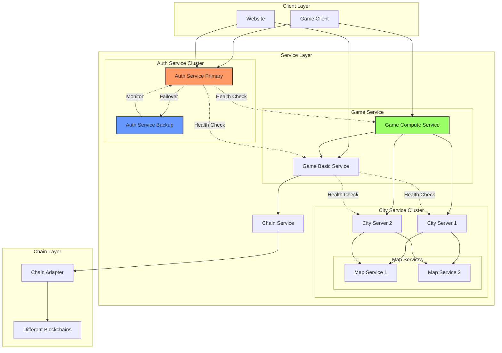

# Arcadia

## System Architecture



## Service Components

### Website Module
- NFT Creation and Minting
- NFT Marketplace
- User Authentication
- Wallet Connection

### Game Basic Service
- Hero Data Management
- Basic Game Logic
- Chain Interaction
- Data Persistence

### Game Compute Service
- Game Logic Processing
- Data Validation
- Combat Calculations
- State Management

### City Service
- City State Management
- Player Interaction
- Resource Management
- Map Service Integration

### Map Service
- Terrain Management
- Position Tracking
- Movement Validation
- Area Effects

### Auth Service
- JWT Token Management
- Node Authentication
- User Authentication
- Service Discovery
- Health Monitoring
- Failover Management

### Chain Service
- Multi-chain Support
- Contract Interaction
- Transaction Processing
- Data Synchronization

## Service Discovery and Recovery

### Health Check Protocol
1. Each service registers with Auth Service
2. Regular heartbeat signals
3. Service state monitoring
4. Automatic failover triggers

### Service Recovery Process
1. Detection: Auth Service detects node failure
2. Election: Backup nodes participate in election
3. Promotion: Selected node becomes primary
4. State Recovery: Load state from blockchain
5. Service Resumption: New node takes over

### Permissionless Node Participation
1. Node Registration
   - Generate keypair
   - Register on chain
   - Obtain node address
   - Join service network

2. Role Assignment
   - Capability declaration
   - State synchronization
   - Service integration

3. Monitoring and Validation
   - Performance monitoring
   - State validation
   - Reputation tracking

4. Graceful Exit
   - State handover
   - Network notification
   - Chain record update

## API 设计

### 1. 节点 API

#### 1.1 节点注册
```
POST /api/v1/node/register
Headers:
  - x-node-address
  - x-node-sign
Body:
  - publicKey: string
  - ip: string
  - port: number
```

#### 1.2 节点认证
```
POST /api/v1/node/auth
Headers:
  - x-node-address
  - x-node-sign
Body:
  - timestamp: number
```

### 2. 用户 API

#### 2.1 用户认证
```
POST /api/v1/user/auth
Headers:
  - x-chain-id
  - x-wallet-address
  - x-user-sign
Body:
  - challenge: string
```

#### 2.2 创建英雄
```
POST /api/v1/hero/create
Headers:
  - x-chain-id
  - x-wallet-address
  - x-user-sign
  - Authorization: Bearer <token>
Body:
  - nftId: string
  - name: string
  - class: string
  - race: string
```

#### 2.3 加载英雄数据
```
GET /api/v1/hero/load
Headers:
  - x-chain-id
  - x-wallet-address
  - Authorization: Bearer <token>
```

#### 2.4 保存英雄数据
```
POST /api/v1/hero/save
Headers:
  - x-chain-id
  - x-wallet-address
  - x-user-sign
  - Authorization: Bearer <token>
Body:
  - heroData: HeroData
```

### 3. 错误处理

#### 3.1 错误码设计
- 1000-1999: 系统错误
- 2000-2999: 认证错误
- 3000-3999: 业务错误
- 4000-4999: 链交互错误

#### 3.2 错误响应格式
```typescript
interface ErrorResponse {
    code: number;
    message: string;
    details?: any;
}
```

## 开发规范

### 1. 代码规范
- 使用 TypeScript
- 遵循 ESLint 规则
- 使用 Prettier 格式化
- 编写单元测试

### 2. 文档规范
- API 文档使用 OpenAPI 3.0
- 代码注释遵循 JSDoc
- 更新 CHANGELOG
- 维护 README

### 3. 部署规范
- 使用 Docker 容器化
- CI/CD自动化部署
- 环境配置分离
- 日志规范化 _MODULE_PUBLISHER_ACCOUNT_PRIVATE_KEY=

    #To fill after you create a collection, will be used for the minting page
    VITE_COLLECTION_ADDRESS="0xbce80457b6911b37c73a67f0996f5c000f4f9a9ad6b5bf240d45a5f613e73592"
    VITE_MODULE_ADDRESS=0xff8f6b4c41bc8995c354d38465ccf811c4fa9f35b02c58b454f6b0cc841e0abb
```
3. `npm run dev`

4. access http://localhost:5173/

5. More configuration, check next section

## How to use Aptos Dapp NFT minting dapp Template

Digital Assets are the NFT standard for Aptos. The Digital Asset template provides an end-to-end NFT minting dapp with a beautiful pre-made UI users can quickly adjust and deploy into a live server.

## Read the NFT minting dapp template docs
To get started with the NFT minting dapp template and learn more about the template functionality and usage, head over to the [NFT minting dapp template docs](https://learn.aptoslabs.com/en/dapp-templates/nft-minting-template) 

## The NFT minting dapp template provides 3 pages:

- **Public Mint NFT Page** - A page for the public to mint NFTs.
- **Create Collection Page** - A page for creating new NFT collections. This page is not accessible on production.
- **My Collections Page** - A page to view all the collections created under the current Move module (smart contract). This page is not accessible on production.

## What tools the template uses?

- React framework
- Vite development tool
- shadcn/ui + tailwind for styling
- Aptos TS SDK
- Aptos Wallet Adapter
- Node based Move commands

## What Move commands are available?

The tool utilizes [aptos-cli npm package](https://github.com/aptos-labs/aptos-cli) that lets us run Aptos CLI in a Node environment.

Some commands are built-in the template and can be ran as a npm script, for example:

- `npm run move:publish` - a command to publish the Move contract
- `npm run move:test` - a command to run Move unit tests
- `npm run move:compile` - a command to compile the Move contract
- `npm run move:upgrade` - a command to upgrade the Move contract
- `npm run dev` - a command to run the frontend locally
- `npm run deploy` - a command to deploy the dapp to Vercel

For all other available CLI commands, can run `npx aptos` and see a list of all available commands.

Points address: 0xee3ff47098abfc3640a626732dac235dfdd807b563d806ee8c20460f22d1df85