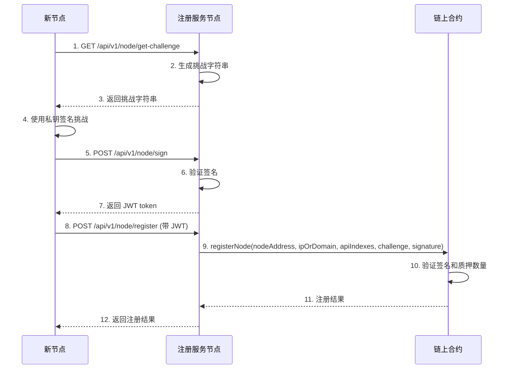
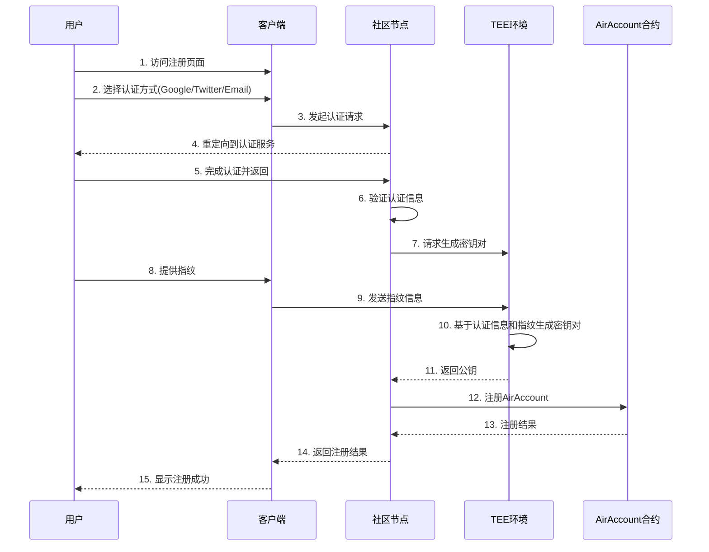
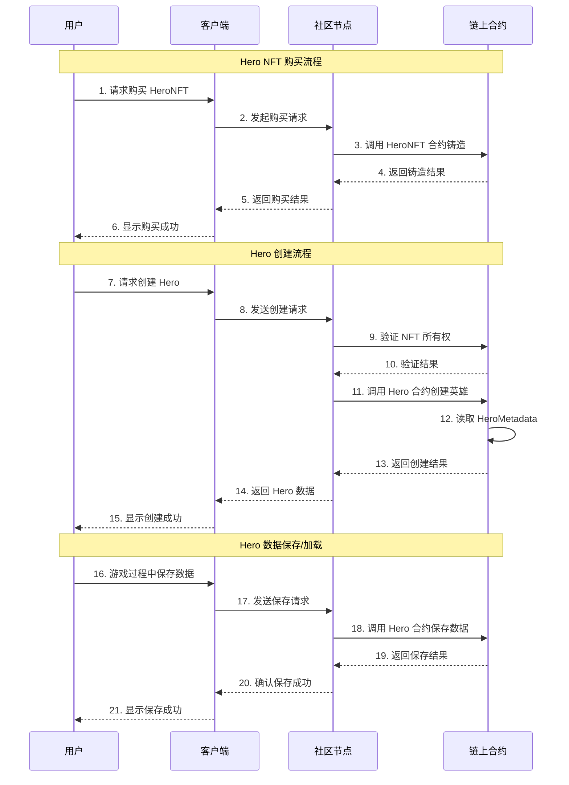

# Features
这个文档描述了 Arcadia Node 的主要功能features。
如[Introduction](./INTRODUCTION.md)文档所述，Arcadia Node 是一个基于区块链的分布式服务节点系统，提供基础服务和扩展服务的注册、发现和管理功能。
如[MODULE_LOGICS](./MODULE_LOGICS.md)文档所述，Arcadia Node 的主要模块逻辑.
本文档会拆分不同的service，每个service对应一个feature。

## Service Flow

### Node Registration and Verification

### User Register Flow 

### GameX: Create, Save and Load

## Detail Features
我们定义features是客户感知到的有价值的能力特征。
那我们的产品客户群包括：
1. 投资者（需要知道你的killer feature是啥）
2. 社区节点运营者（希望提供计算服务获得稳定收入）
3. 产品用户（希望不同产品获得不同的能力特征赋能）

我们的产品如前所示：
1. COS72:整合我们基础能力和扩展能力的系统，社区收入系统和无数个插件模块，适合社区使用。
2. AirAccount/SuperPaymaster：为普通用户提供简单的payandgo的加密无gas体验。
3. ZuCoffee：帮助全球商业体验Web3商业便利的IT系统，包括链上Shop和移动支付。
4. Arcaida：一个开放的游戏世界，支持众创，嵌入了Arcadia Business。
5. ArcaidaNode：社区节点体系，你可以不使用Cos72,但是提供Cos72的计算服务。
6. 更多的产品，已插件形式嵌入在COS72中。

### Client端核心feature
http://localhost:3008/pages/hero-test.html
1. 配合合约，用户可以创建Hero，加载Hero数据，保存Hero数据。
2. 未来此页面逻辑会嵌入到server端，成为API，而部分交互逻辑会提炼成为客户端交互的模板。
3. 

### GameX: Create, Save and Load
1. 基础参数：chainId, userOperations(long signature include tx and fingerprint), nodeSignature
2. 

