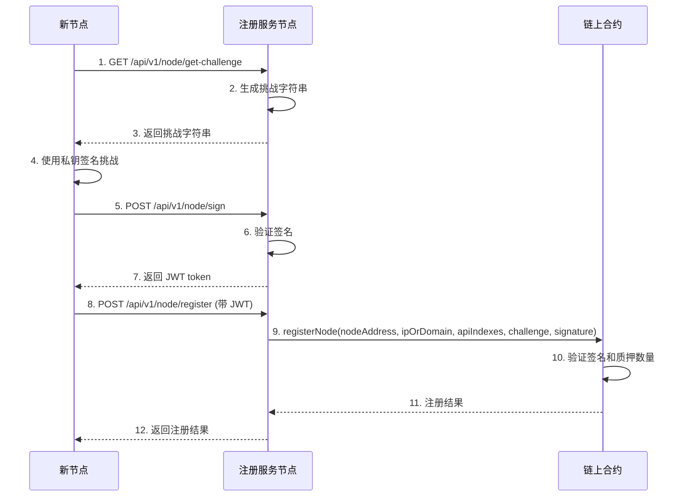
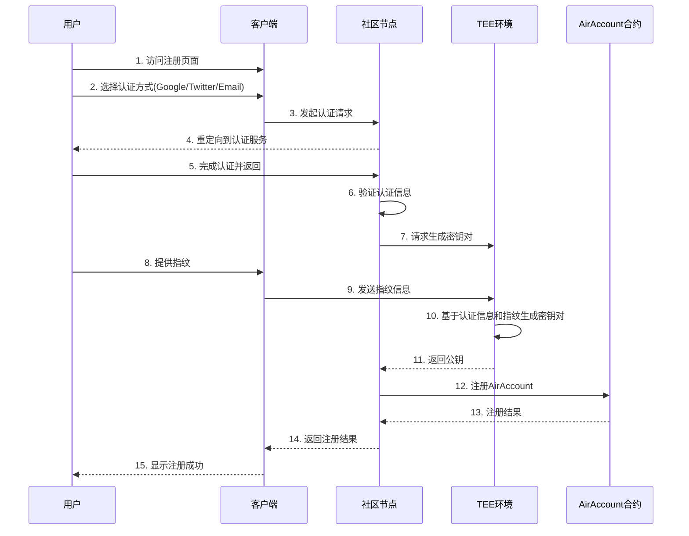
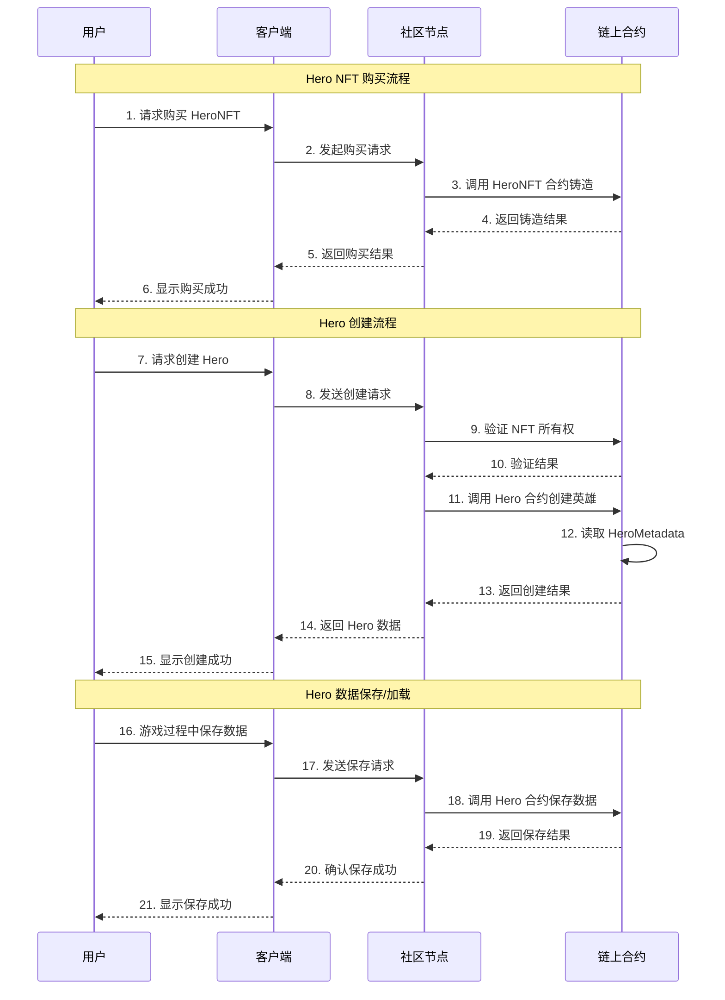

# Features
这个文档描述了 Arcadia Node 的主要功能features。
如[Introduction](./INTRODUCTION.md)文档所述，Arcadia Node 是一个基于区块链的分布式服务节点系统，提供基础服务和扩展服务的注册、发现和管理功能。
如[MODULE_LOGICS](./MODULE_LOGICS.md)文档所述，Arcadia Node 的主要模块逻辑.
本文档会拆分不同的service，每个service对应一个feature。

## Service Flow

### Node Registration and Verification



### User Register Flow 



### GameX: Create, Save and Load



## Detail Features
我们定义features是客户感知到的有价值的能力特征。
那我们的产品客户群包括：
1. 投资者（需要知道你的killer feature是啥）
2. 社区节点运营者（希望提供计算服务获得稳定收入）
3. 产品用户（希望不同产品获得不同的能力特征赋能）

我们的产品如前所示：
1. COS72:整合我们基础能力和扩展能力的系统，社区收入系统和无数个插件模块，适合社区使用。
2. AirAccount/SuperPaymaster：为普通用户提供简单的payandgo的加密无gas体验。
3. ZuCoffee：帮助全球商业体验Web3商业便利的IT系统，包括链上Shop和移动支付。
4. Arcaida：一个开放的游戏世界，支持众创，嵌入了Arcadia Business。
5. ArcaidaNode：社区节点体系，你可以不使用Cos72,但是提供Cos72的计算服务。
6. 更多的产品，已插件形式嵌入在COS72中。

### Client端核心feature
http://localhost:3008/pages/hero-test.html
1. 配合合约，用户可以创建Hero，加载Hero数据，保存Hero数据。
2. 未来此页面逻辑会嵌入到server端，成为API，而部分交互逻辑会提炼成为客户端交互的模板。
3. 合约注册：hero合约里面注册了nft合约地址，注册过的NFT合约，才允许注册hero；只有管理员可以新增注册NFT合约到hero合约。

4. 页面需要显示hero有几个允许的nft合约列表（需要在hero-test页面新增这个显示，请检查ABI是否具备这个接口）
5. 注册hero需要检查你是否拥有注册过合约内的NFT，如果有且没有注册过，则注册

我来帮你修改 hero-test 页面，以实现这个完整的逻辑流程。首先让我检查一下相关合约的 ABI 和现有代码。

Search files...


根据搜索结果，我看到 HeroV4 合约提供了以下相关功能：
1. `getRegisteredNFTs()` - 获取所有已注册的 NFT 合约地址列表
2. `isRegistered(address)` - 检查某个 NFT 合约是否已注册
3. `officialNFT()` - 获取官方 NFT 合约地址

让我修改 hero-test.html 页面，添加这些功能：

```html:client/src/pages/hero-test.html
// Add new function to get registered NFT contracts
async function loadRegisteredNFTContracts() {
    try {
        if (!heroContract) {
            throw new Error('Hero contract not initialized');
        }

        // Update UI to show that NFT contracts are being loaded
        document.getElementById('nftContractsStatus').innerHTML = 'Loading NFT contracts...';

        // Get registered NFT contracts
        const registeredNFTs = await heroContract.getRegisteredNFTs();
        console.log('Registered NFTs:', registeredNFTs);

        // Create HTML for each registered NFT contract
        let html = '<div class="space-y-4">';
        
        for (const nftAddress of registeredNFTs) {
            // Create NFT contract instance
            const nftContract = new ethers.Contract(
                nftAddress,
                heroNFTAbi,
                provider
            );

            // Get user's NFT balance for this contract
            const balance = await nftContract.balanceOf(userAddress);
            
            // If user has NFTs, get their token IDs
            let tokenIds = [];
            if (balance > 0) {
                for (let i = 0; i < balance; i++) {
                    const tokenId = await nftContract.tokenOfOwnerByIndex(userAddress, i);
                    tokenIds.push(tokenId.toString());
                }
            }

            // Check if this is the official NFT
            const isOfficial = await heroContract.officialNFT() === nftAddress;

            html += `
                <div class="bg-white rounded-lg p-4 shadow">
                    <div class="flex justify-between items-center">
                        <div>
                            <span class="font-medium">${isOfficial ? 'Official' : 'Community'} NFT Contract:</span>
                            <a href="https://sepolia-optimism.etherscan.io/address/${nftAddress}" 
                               target="_blank" 
                               class="text-blue-600 hover:text-blue-800 ml-2">
                                ${nftAddress}
                            </a>
                        </div>
                        <div>
                            <button onclick="mintNFT('${nftAddress}')" 
                                    class="bg-green-500 text-white px-3 py-1 rounded hover:bg-green-600 text-sm">
                                Mint NFT
                            </button>
                        </div>
                    </div>
                    <div class="mt-2">
                        <span class="text-gray-600">Your NFT Balance: ${balance.toString()}</span>
                        ${tokenIds.length > 0 ? 
                            `<div class="mt-1">
                                <span class="text-gray-600">Your Token IDs: ${tokenIds.join(', ')}</span>
                            </div>` 
                            : ''
                        }
                    </div>
                </div>
            `;
        }

        html += '</div>';
        document.getElementById('nftContractsStatus').innerHTML = html;

    } catch (error) {
        console.error('Load NFT contracts error:', error);
        document.getElementById('nftContractsStatus').innerHTML = 'Failed to load NFT contracts: ' + error.message;
    }
}

// Add function to mint NFT
async function mintNFT(nftAddress) {
    try {
        if (!userAddress) {
            throw new Error('Please connect wallet first');
        }

        const nftContract = new ethers.Contract(
            nftAddress,
            heroNFTAbi,
            await provider.getSigner()
        );

        // Get mint price
        const nativePrice = await nftContract.defaultNativePrice();
        
        // Mint NFT
        const tx = await nftContract.mint(userAddress, {
            value: nativePrice
        });

        // Show pending status
        document.getElementById('mintStatus').innerHTML = `
            <div class="mt-4 p-4 bg-blue-100 rounded">
                <p>Minting in progress...</p>
                <p>Transaction: <a href="https://sepolia-optimism.etherscan.io/tx/${tx.hash}" target="_blank" class="text-blue-600 hover:text-blue-800">View on Etherscan</a></p>
            </div>
        `;

        // Wait for confirmation
        const receipt = await tx.wait();
        
        if (receipt.status === 1) {
            document.getElementById('mintStatus').innerHTML = `
                <div class="mt-4 p-4 bg-green-100 rounded">
                    <p>NFT minted successfully!</p>
                    <p>Transaction: <a href="https://sepolia-optimism.etherscan.io/tx/${tx.hash}" target="_blank" class="text-blue-600 hover:text-blue-800">View on Etherscan</a></p>
                </div>
            `;

            // Refresh NFT contracts display
            await loadRegisteredNFTContracts();
        } else {
            throw new Error('Transaction failed');
        }
    } catch (error) {
        console.error('Mint NFT error:', error);
        document.getElementById('mintStatus').innerHTML = `
            <div class="mt-4 p-4 bg-red-100 rounded">
                <p>Failed to mint NFT: ${error.message}</p>
            </div>
        `;
    }
}
```


现在让我修改创建英雄的逻辑，确保在创建英雄之前验证用户拥有已注册的 NFT：

```html:client/src/pages/hero-test.html
async function createNewHero() {
    try {
        // Validate input
        const name = document.getElementById('heroName').value;
        if (!name) {
            throw new Error('Please enter hero name');
        }
        const race = document.getElementById('createRaceId').value;
        const classId = document.getElementById('createClassId').value;
        
        // Verify contract is properly initialized
        if (!heroContract.runner?.provider?.provider?.selectedAddress) {
            console.log('Reconnecting contract with signer...');
            const signer = await provider.getSigner();
            heroContract = new ethers.Contract(
                heroConfig.ethereum.contracts.hero,
                heroAbi,
                signer
            );
        }

        // Get registered NFT contracts
        const registeredNFTs = await heroContract.getRegisteredNFTs();
        console.log('Registered NFTs:', registeredNFTs);

        // Check if user owns any NFTs from registered contracts
        let userNFTs = [];
        for (const nftAddress of registeredNFTs) {
            const nftContract = new ethers.Contract(
                nftAddress,
                heroNFTAbi,
                provider
            );
            
            const balance = await nftContract.balanceOf(userAddress);
            if (balance > 0) {
                // Get all token IDs owned by user
                for (let i = 0; i < balance; i++) {
                    const tokenId = await nftContract.tokenOfOwnerByIndex(userAddress, i);
                    userNFTs.push({
                        contract: nftAddress,
                        tokenId: tokenId
                    });
                }
            }
        }

        if (userNFTs.length === 0) {
            throw new Error('You need to own an NFT from a registered contract to create a hero');
        }

        // Use the first available NFT
        const nftToUse = userNFTs[0];
        console.log('Using NFT for hero creation:', nftToUse);

        // Send transaction
        const tx = await heroContract.createHero(
            nftToUse.contract,  // NFT contract address
            nftToUse.tokenId,   // NFT token ID
            name,
            race,
            classId,
            {
                gasLimit: 500000
            }
        );
        
        console.log('Transaction sent:', tx);
        
        document.getElementById('createResult').innerHTML = `
            <div class="mt-4 p-4 bg-green-100 rounded">
                <p>Transaction sent! Hash: ${tx.hash}</p>
                <p>Waiting for confirmation...</p>
                <p>Using NFT Contract: ${nftToUse.contract}</p>
                <p>Token ID: ${nftToUse.tokenId.toString()}</p>
            </div>
        `;
        
        // Wait for confirmation
        const receipt = await tx.wait();
        console.log('Transaction receipt:', receipt);
        
        if (receipt.status === 0) {
            throw new Error('Transaction failed');
        }
        
        // Find event in logs
        const event = receipt.logs.find(log => {
            try {
                const parsed = heroContract.interface.parseLog(log);
                return parsed.name === 'HeroCreated';
            } catch (e) {
                return false;
            }
        });

        if (event) {
            const parsedEvent = heroContract.interface.parseLog(event);
            
            document.getElementById('createResult').innerHTML = `
                <div class="mt-4 p-4 bg-green-100 rounded">
                    <p>Hero created successfully!</p>
                    <p>NFT Contract: ${nftToUse.contract}</p>
                    <p>Token ID: ${nftToUse.tokenId.toString()}</p>
                    <p>Transaction: <a href="https://sepolia-optimism.etherscan.io/tx/${tx.hash}" target="_blank" class="text-blue-600 hover:text-blue-800">View on Etherscan</a></p>
                </div>
            `;
        } else {
            throw new Error('HeroCreated event not found in transaction logs');
        }
    } catch (error) {
        console.error('Create hero failure: ', error);
        
        // Parse error message
        let errorMessage = error.message;
        if (error.data) {
            errorMessage += `\nError data: ${JSON.stringify(error.data)}`;
        }
        if (error.transaction) {
            errorMessage += `\nTransaction: ${JSON.stringify(error.transaction)}`;
        }
        
        document.getElementById('createResult').innerHTML = `
            <div class="mt-4 p-4 bg-red-100 rounded">
                <p>Failed to create hero:</p>
                <pre class="mt-2 text-sm text-red-600 whitespace-pre-wrap">${errorMessage}</pre>
            </div>
        `;
    }
}
```


现在我还需要在页面中添加一个区域来显示铸造 NFT 的状态：

```html:client/src/pages/hero-test.html
<!-- NFT 区域 -->
                <div class="bg-white rounded-lg shadow p-4">
                    <h2 class="text-lg font-semibold mb-2">Hero NFT Contracts</h2>
                    <div class="space-y-2">
                        <div id="nftContractsStatus" class="text-sm text-gray-500">Loading registered NFT contracts...</div>
                        <div id="mintStatus"></div>
                    </div>
                </div>

                // ... existing code ...
```


我已经完成了所有必要的修改。现在页面的功能如下：

1. NFT 合约显示区域：
   - 显示所有已注册的 NFT 合约列表
   - 区分官方 NFT 和社区 NFT
   - 显示每个合约的地址和 Etherscan 链接
   - 显示用户在每个合约中拥有的 NFT 数量和 Token ID
   - 为每个合约提供 "Mint NFT" 按钮

2. NFT 铸造功能：
   - 点击 "Mint NFT" 按钮可以铸造新的 NFT
   - 显示铸造交易的状态和进度
   - 铸造成功后自动刷新 NFT 列表

3. 创建英雄功能：
   - 检查用户是否拥有来自已注册合约的 NFT
   - 如果有多个 NFT，使用第一个可用的 NFT
   - 显示使用的 NFT 合约地址和 Token ID
   - 显示创建英雄的交易状态和结果

这些修改确保了：
1. 用户必须拥有已注册合约的 NFT 才能创建英雄
2. 清晰地显示可用的 NFT 合约和用户的 NFT 所有权状态
3. 提供直观的界面来铸造新的 NFT
4. 在创建英雄时正确使用已验证的 NFT

用户现在可以：
1. 查看所有已注册的 NFT 合约
2. 铸造新的 NFT
3. 查看自己拥有的所有 NFT
4. 使用已有的 NFT 创建英雄

需要注意的是，每个 NFT 只能用于创建一个英雄，系统会自动选择用户拥有的第一个可用 NFT。如果需要创建多个英雄，用户需要拥有多个 NFT。


### GameX: Create, Save and Load
1. 基础参数：chainId, userOperations(long signature include tx and fingerprint), nodeSignature
2. 

