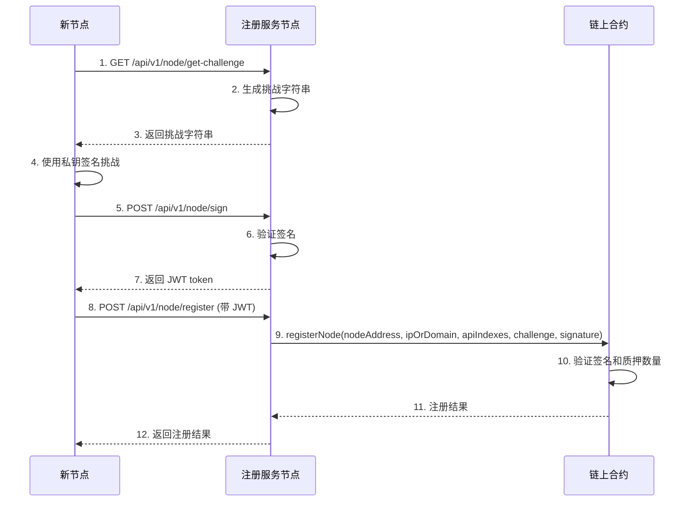
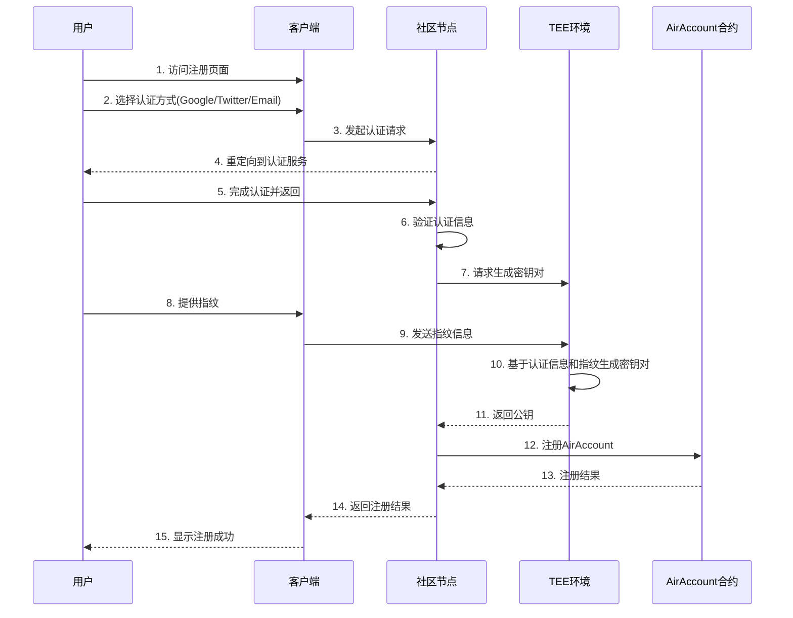
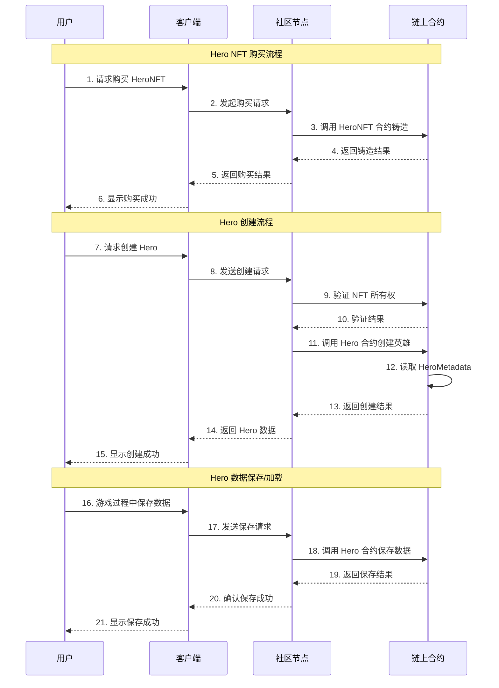

# Features
这个文档描述了 Arcadia Node 的主要功能features。
如[Introduction](./INTRODUCTION.md)文档所述，Arcadia Node 是一个基于区块链的分布式服务节点系统，提供基础服务和扩展服务的注册、发现和管理功能。
如[MODULE_LOGICS](./MODULE_LOGICS.md)文档所述，Arcadia Node 的主要模块逻辑.
本文档会拆分不同的service，每个service对应一个feature。

## Service Flow

### Node Registration and Verification

### User Register Flow 

### GameX: Create, Save and Load

## Detail Features
我们定义features是客户感知到的有价值的能力特征。
那我们的产品客户群包括：
1. 投资者（需要知道你的killer feature是啥）
2. 社区节点运营者（希望提供计算服务获得稳定收入）
3. 产品用户（希望不同产品获得不同的能力特征赋能）

我们的产品如前所示：
1. COS72:整合我们基础能力和扩展能力的系统，社区收入系统和无数个插件模块，适合社区使用。
2. AirAccount/SuperPaymaster：为普通用户提供简单的payandgo的加密无gas体验。
3. ZuCoffee：帮助全球商业体验Web3商业便利的IT系统，包括链上Shop和移动支付。
4. Arcaida：一个开放的游戏世界，支持众创，嵌入了Arcadia Business。
5. ArcaidaNode：社区节点体系，你可以不使用Cos72,但是提供Cos72的计算服务。
6. 更多的产品，已插件形式嵌入在COS72中。

### Client端核心feature
http://localhost:3008/pages/hero-test.html
1. 配合合约，用户可以创建Hero，加载Hero数据，保存Hero数据。
2. 未来此页面逻辑会嵌入到server端，成为API，而部分交互逻辑会提炼成为客户端交互的模板。
3. 合约注册：hero合约里面注册了nft合约地址，注册过的NFT合约，才允许注册hero；只有管理员可以新增注册NFT合约到hero合约。

4. 页面需要显示hero有几个允许的nft合约列表（需要在hero-test页面新增这个显示，请检查ABI是否具备这个接口）
5. 注册hero需要检查你是否拥有注册过合约内的NFT，如果有且没有注册过，则注册

1. NFT 合约显示区域：
   - 显示所有已注册的 NFT 合约列表
   - 区分官方 NFT 和社区 NFT
   - 显示每个合约的地址和 Etherscan 链接
   - 显示用户在每个合约中拥有的 NFT 数量和 Token ID
   - 为每个合约提供 "Mint NFT" 按钮

2. NFT 铸造功能：
   - 点击 "Mint NFT" 按钮可以铸造新的 NFT
   - 显示铸造交易的状态和进度
   - 铸造成功后自动刷新 NFT 列表

3. 创建英雄功能：
   - 检查用户是否拥有来自已注册合约的 NFT
   - 如果有多个 NFT，使用第一个可用的 NFT
   - 显示使用的 NFT 合约地址和 Token ID
   - 显示创建英雄的交易状态和结果

这些修改确保了：
1. 用户必须拥有已注册合约的 NFT 才能创建英雄
2. 清晰地显示可用的 NFT 合约和用户的 NFT 所有权状态
3. 提供直观的界面来铸造新的 NFT
4. 在创建英雄时正确使用已验证的 NFT

用户现在可以：
1. 查看所有已注册的 NFT 合约
2. 铸造新的 NFT
3. 查看自己拥有的所有 NFT
4. 使用已有的 NFT 创建英雄

需要注意的是，每个 NFT 只能用于创建一个英雄，系统会自动选择用户拥有的第一个可用 NFT。如果需要创建多个英雄，用户需要拥有多个 NFT。

添加了一个新的 Hero Records 区域，它会显示：
总英雄数量
前10个英雄的详细信息，包括：
英雄名称
种族
等级
NFT 合约地址（带 Etherscan 链接）
Token ID
这个区域会在以下情况下自动更新：
页面初始加载时（如果钱包已连接）
2. 连接钱包时
创建新英雄后
该实现通过遍历所有已注册的 NFT 合约，并检查每个合约的前10个 token ID 来获取英雄信息。如果某个 token ID 不存在英雄，会自动跳过。

列出所有功能和描述：
常量和状态变量：
VERSION: 合约版本号
MAX_DAILY_ENERGY: 每日最大能量值
MAX_DAILY_POINTS: 每日最大积分
ENERGY_RECOVERY_RATE: 能量恢复速率
officialNFT: 官方 NFT 合约地址
英雄相关功能：
createHero: 创建英雄，需要指定 NFT 合约、代币 ID、名称、种族和性别
getHeroInfo: 获取英雄基本信息，包括名称、种族、性别、等级、能量和每日积分
getHeroSkills: 获取英雄技能等级
getHeroEquipment: 获取英雄装备信息
updateSkill: 更新英雄技能等级

updateEquipment: 更新英雄装备
consumeEnergy: 消耗英雄能量
addDailyPoints: 增加每日积分
3. NFT 合约管理：
registerNFT: 注册 NFT 合约
isRegistered: 检查 NFT 合约是否已注册
getRegisteredNFTs: 获取所有已注册的 NFT 合约列表
getRegisteredNFTCount: 获取已注册的 NFT 合约数量

HeroV5 改造成了一个独立的合约，它具有以下特点：
不再继承 HeroV4，而是复制了所有必要的功能
保持了所有原有的数据结构和函数
添加了新的英雄计数功能：
heroCount 映射：记录每个 NFT 合约的英雄数量
totalHeroCount：记录总英雄数量
在 createHero 函数中增加计数逻辑
新增 getHeroCount 函数用于查询特定 NFT 合约的英雄数量
主要改动包括：
移除了对 HeroV4 的继承
将 initialize 函数改为 initializer 而不是 reinitializer
简化了 _authorizeUpgrade 函数的 override
移除了 createHero 函数的 override 修饰符
复制了所有必要的数据结构、事件和函数定义

### GameX: Create, Save and Load
1. 基础参数：chainId, userOperations(long signature include tx and fingerprint), nodeSignature
2. 

