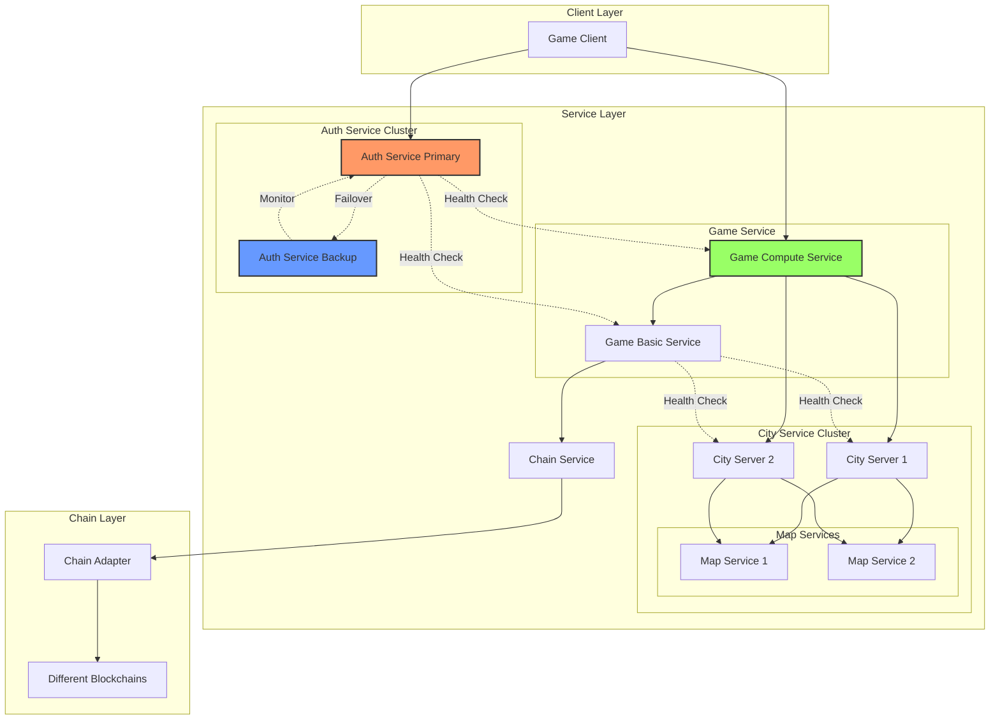

# Arcadia

## System Architecture



## Service Components

1. **节点注册/节点验证组件**：依赖链上合约注册和节点提供 API。
2. **服务注册/服务发现组件**：依赖节点运行此服务。
3. **用户注册/登录组件**：处理用户的注册和认证。
4. **链交互组件**：负责与区块链的交互。

### 可选服务组件

- 至少运行一个可选的业务组件
- **游戏服务组件**：处理游戏逻辑和数据。
- **内容评论组件**：管理用户评论。
- **物品交易组件**：处理物品的买卖。
- **资产发行组件**：管理数字资产的发行。
- **更多组件**：根据需求添加。

### 架构设计

- **API 服务**：所有服务组件通过 API 提供对外服务。
- **服务组件间通信**：主要通过 API 通信，部分采用进程内通信。
- **服务发现**：通过服务发现组件获取依赖服务。
- **节点**：运行服务组件的服务器，每个节点可选择运行相关组件。

## Service Discovery and Recovery

### Health Check Protocol
1. Each service registers with Auth Service
2. Regular heartbeat signals
3. Service state monitoring
4. Automatic failover triggers

### Service Recovery Process
1. Detection: Auth Service detects node failure
2. Election: Backup nodes participate in election
3. Promotion: Selected node becomes primary
4. State Recovery: Load state from blockchain
5. Service Resumption: New node takes over

### Permissionless Node Participation
1. Node Registration
   - Generate keypair
   - Register on chain
   - Obtain node address
   - Join service network

2. Role Assignment
   - Capability declaration
   - State synchronization
   - Service integration

3. Monitoring and Validation
   - Performance monitoring
   - State validation
   - Reputation tracking

4. Graceful Exit
   - State handover
   - Network notification
   - Chain record update

## API 设计

### 1. 节点 API

#### 1.1 节点注册

新节点注册有两个验证：
1. 新节点是否 address、公钥、challenge 挑战签名是否一致（注册服务节点提供）
2. 新节点是否已经质押（链上合约验证）
3. 注册服务节点提交交易（必须有 chain service 提供）
4. 是否运行自我注册？鉴于挑战字符串是随机生成的，新节点无法提前知道，所以需要注册服务节点提供挑战字符串，然后获得 jwt，提交注册信息，注册服务节点帮助注册到合约。
5.  - 合约部署者自动成为第一个注册者
   - 只有注册者可以帮助其他节点注册


##### Graph
sequenceDiagram
    participant NewNode as 新节点
    participant API as 注册服务节点
    participant Contract as 链上合约

    NewNode->>API: 1. GET /api/v1/node/get-challenge
    API->>Contract: 2. getChallenge()
    Contract-->>API: 3. 返回挑战字符串
    API-->>NewNode: 4. 返回挑战字符串

    NewNode->>NewNode: 5. 使用私钥签名挑战
    NewNode->>API: 6. POST /api/v1/node/sign
    API->>API: 7. 验证签名
    API-->>NewNode: 8. 返回 JWT token

    NewNode->>API: 9. POST /api/v1/node/register (带 JWT)
    API->>Contract: 10. registerNodeByRegistrar()
    Contract-->>API: 11. 注册结果
    API-->>NewNode: 12. 返回注册结果

```
POST /api/v1/node/register
Headers:
  - x-node-address
  - x-node-sign
Body:
  - publicKey: string
  - ip: string
  - port: number
```

The registration process now works as follows:
A node obtains a challenge from the API
The node signs this challenge with their private key
3. When registering, they provide:
Their node address
IP/Domain
API indexes (as a JSON string of indexes)
The challenge
Their signature of the challenge
The contract verifies:
The registrar is a registered node
The new node isn't already registered
The signature is valid for the provided challenge
The node has sufficient stake


#### 1.2 节点认证
```
POST /api/v1/node/auth
Headers:
  - x-node-address
  - x-node-sign
Body:
  - timestamp: number
```

### 2. 用户 API

#### 2.1 用户认证
```
POST /api/v1/user/auth
Headers:
  - x-chain-id
  - x-wallet-address
  - x-user-sign
Body:
  - challenge: string
```

#### 2.2 创建英雄
```
POST /api/v1/hero/create
Headers:
  - x-chain-id
  - x-wallet-address
  - x-user-sign
  - Authorization: Bearer <token>
Body:
  - nftId: string
  - name: string
  - class: string
  - race: string
```

#### 2.3 加载英雄数据
```
GET /api/v1/hero/load
Headers:
  - x-chain-id
  - x-wallet-address
  - Authorization: Bearer <token>
```

#### 2.4 保存英雄数据
```
POST /api/v1/hero/save
Headers:
  - x-chain-id
  - x-wallet-address
  - x-user-sign
  - Authorization: Bearer <token>
Body:
  - heroData: HeroData
```

### 3. 错误处理

#### 3.1 错误码设计
- 1000-1999: 系统错误
- 2000-2999: 认证错误
- 3000-3999: 业务错误
- 4000-4999: 链交互错误

#### 3.2 错误响应格式
```typescript
interface ErrorResponse {
    code: number;
    message: string;
    details?: any;
}
```

## 开发规范

### 1. 代码规范
- 使用 TypeScript
- 遵循 ESLint 规则
- 使用 Prettier 格式化
- 编写单元测试

### 2. 文档规范
- API 文档使用 OpenAPI 3.0
- 代码注释遵循 JSDoc
- 更新 CHANGELOG
- 维护 README

### 3. 部署规范
- 使用 Docker 容器化
- CI/CD自动化部署
- 环境配置分离
- 日志规范化 _MODULE_PUBLISHER_ACCOUNT_PRIVATE_KEY=

## 目录结构
root/
├── node_modules/        # 所有依赖
├── data/               # 服务配置数据
│   └── service_list.json # 服务列表配置
├── docs/               # 项目文档
│   └── design.md       # 系统设计文档
├── .env                # 环境变量
├── .env.example        # 环境变量示例
├── app.js             # 主入口文件
├── package.json       # 项目配置
│
├── server/            # 基础服务
│   ├── node/         # 节点服务
│   ├── service/      # 服务发现
│   ├── user/         # 用户服务
│   ├── chain/        # 链服务
│   └── health/       # 健康检查
│
└── serverx/          # 扩展服务
    ├── gamex/        # 游戏服务
    ├── comment/      # 评论服务
    ├── item/         # 物品服务
    └── asset/        # 资产服务
