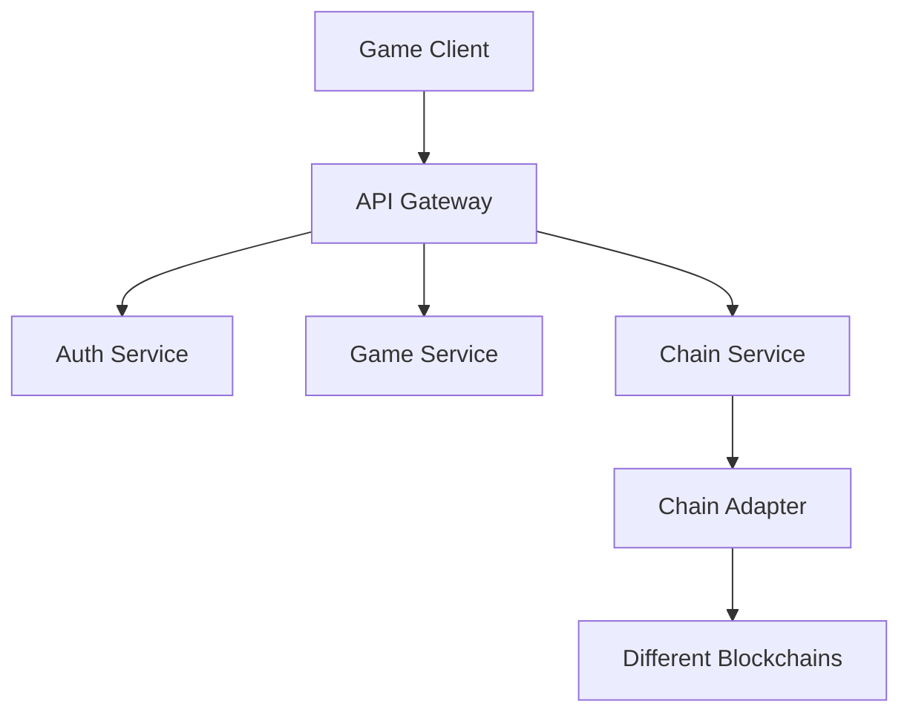

<!DOCTYPE html>
<html lang="zh-CN">
<head>
    <meta charset="UTF-8">
    <meta name="viewport" content="width=device-width, initial-scale=1.0">
    <title>Arcadia Node - 服务列表</title>
    <style>
        body {
            font-family: system-ui, -apple-system, sans-serif;
            max-width: 1200px;
            margin: 0 auto;
            padding: 20px;
            line-height: 1.6;
            background-color: #f5f5f5;
        }
        .container {
            background-color: #fff;
            padding: 20px;
            border-radius: 5px;
            box-shadow: 0 2px 4px rgba(0,0,0,0.1);
            margin-bottom: 20px;
            overflow-x: auto;
        }
        h1, h2 {
            color: #333;
            border-bottom: 2px solid #333;
            padding-bottom: 10px;
        }
        table {
            width: 100%;
            border-collapse: collapse;
            margin: 10px 0;
            font-size: 14px;
        }
        th, td {
            padding: 8px;
            text-align: left;
            border-bottom: 1px solid #ddd;
        }
        th {
            background-color: #f8f9fa;
            font-weight: 600;
        }
        tr:hover {
            background-color: #f5f5f5;
        }
        .endpoint {
            font-family: monospace;
            background-color: #e9ecef;
            padding: 2px 5px;
            border-radius: 3px;
        }
        .type-badge {
            display: inline-block;
            padding: 2px 8px;
            border-radius: 12px;
            font-size: 12px;
            color: white;
        }
        .type-badge.basic {
            background-color: #007bff;
        }
        .type-badge.extend {
            background-color: #28a745;
        }
        .btn {
            padding: 4px 8px;
            border: none;
            border-radius: 4px;
            cursor: pointer;
            font-size: 12px;
            transition: background-color 0.2s;
        }
        .btn-test {
            background-color: #17a2b8;
            color: white;
        }
        .btn-test:hover {
            background-color: #138496;
        }
        .params-input {
            width: 100%;
            padding: 4px;
            border: 1px solid #ddd;
            border-radius: 4px;
            font-family: monospace;
            font-size: 12px;
            margin-top: 4px;
        }
        .response-area {
            display: none;
            margin-top: 8px;
            padding: 8px;
            background-color: #f8f9fa;
            border-radius: 4px;
            font-family: monospace;
            font-size: 12px;
            white-space: pre-wrap;
        }
        .directory-tree {
            font-family: monospace;
            white-space: pre;
            font-size: 14px;
            line-height: 1.4;
        }
    </style>
</head>
<body>
    <div class="container">
        <h1>Arcadia Node - 服务列表</h1>
        
        <h2>基础服务</h2>
        <table id="basicServiceTable">
            <thead>
                <tr>
                    <th>服务</th>
                    <th>名称</th>
                    <th>端点</th>
                    <th>参数</th>
                    <th>操作</th>
                </tr>
            </thead>
            <tbody></tbody>
        </table>

        <h2>扩展服务</h2>
        <table id="extendServiceTable">
            <thead>
                <tr>
                    <th>服务</th>
                    <th>名称</th>
                    <th>端点</th>
                    <th>参数</th>
                    <th>操作</th>
                </tr>
            </thead>
            <tbody></tbody>
        </table>
    </div>

    <div class="container">
        <h2>目录结构</h2>
        <div class="directory-tree">
root/
├── node_modules/        # 所有依赖
├── data/               # 服务配置数据
├── .env                # 环境变量
├── .env.example        # 环境变量示例
├── app.js             # 主入口文件
├── package.json       # 项目配置
│
├── server/            # 基础服务
│   ├── node/         # 节点服务
│   ├── service/      # 服务发现
│   ├── user/         # 用户服务
│   ├── chain/        # 链服务
│   └── health/       # 健康检查
│
└── serverx/          # 扩展服务
    ├── gamex/        # 游戏服务
    ├── comment/      # 评论服务
    ├── item/         # 物品服务
    └── asset/        # 资产服务</div>
    </div>

    <script>
        // 默认参数配置
        const defaultParams = {
            'node_register': { nodeId: 'test-node-1', address: 'http://localhost:3001' },
            'node_routes_list': { nodeId: 'test-node-1' },
            'service_register': { serviceId: 'test-service-1', nodeId: 'test-node-1', type: 'basic' },
            'service_list': { type: 'basic' },
            'service_remove': { serviceId: 'test-service-1' },
            'user_register': { username: 'testuser', password: 'password123' },
            'user_login': { username: 'testuser', password: 'password123' },
            'node_heartbeat': { nodeId: 'test-node-1' },
            'chain_hero_create': { userId: '1', name: 'Hero1' },
            'chain_hero_load': { userId: '1', heroId: '1' },
            'chain_hero_save': { userId: '1', heroId: '1', data: {} }
        };

        // 测试服务接口
        async function testService(name, url, params) {
            const responseArea = document.getElementById(`response-${name}`);
            responseArea.style.display = 'block';
            responseArea.textContent = '请求中...';
            
            try {
                const response = await fetch(url, {
                    method: 'POST',
                    headers: {
                        'Content-Type': 'application/json'
                    },
                    body: params
                });
                const data = await response.json();
                responseArea.textContent = JSON.stringify(data, null, 2);
            } catch (error) {
                responseArea.textContent = `错误：${error.message}`;
            }
        }

        // 获取服务列表
        fetch('/data/service_list.json')
            .then(response => response.json())
            .then(services => {
                const basicServiceTable = document.querySelector('#basicServiceTable tbody');
                const extendServiceTable = document.querySelector('#extendServiceTable tbody');
                
                services.forEach(service => {
                    const tr = document.createElement('tr');
                    const defaultParam = defaultParams[service.name] || {};
                    
                    tr.innerHTML = `
                        <td>
                            ${service.description}
                            <span class="type-badge ${service.type}">
                                ${service.type === 'basic' ? '基础' : '扩展'}
                            </span>
                        </td>
                        <td>${service.name}</td>
                        <td><span class="endpoint">${service.url}</span></td>
                        <td>
                            <textarea class="params-input" id="params-${service.name}">${JSON.stringify(defaultParam, null, 2)}</textarea>
                        </td>
                        <td>
                            <button class="btn btn-test" onclick="testService('${service.name}', '${service.url}', document.getElementById('params-${service.name}').value)">测试</button>
                            <div class="response-area" id="response-${service.name}"></div>
                        </td>
                    `;
                    
                    if (service.type === 'basic') {
                        basicServiceTable.appendChild(tr);
                    } else {
                        extendServiceTable.appendChild(tr);
                    }
                });
            })
            .catch(error => console.error('Error loading services:', error));
    </script>
</body>
</html> ain-id
  - x-wallet-address
  - Authorization: Bearer <token>
```

#### 2.4 保存英雄数据
```
POST /api/v1/hero/save
Headers:
  - x-chain-id
  - x-wallet-address
  - x-user-sign
  - Authorization: Bearer <token>
Body:
  - heroData: HeroData
```

### 3. 错误处理

#### 3.1 错误码设计
- 1000-1999: 系统错误
- 2000-2999: 认证错误
- 3000-3999: 业务错误
- 4000-4999: 链交互错误

#### 3.2 错误响应格式
```typescript
interface ErrorResponse {
    code: number;
    message: string;
    details?: any;
}
```

## 开发规范

### 1. 代码规范
- 使用 TypeScript
- 遵循 ESLint 规则
- 使用 Prettier 格式化
- 编写单元测试

### 2. 文档规范
- API 文档使用 OpenAPI 3.0
- 代码注释遵循 JSDoc
- 更新 CHANGELOG
- 维护 README

### 3. 部署规范
- 使用 Docker 容器化
- CI/CD自动化部署
- 环境配置分离
- 日志规范化 _MODULE_PUBLISHER_ACCOUNT_PRIVATE_KEY=

## Questions I ask AI


### idea1

对于架构，我们有预期如下：
   1> server 端服务将由 nodejs 技术栈提供对外的 API 服务
   2> server 端的部署将会部署为多个服务组件，每个组件之间多数采用 API 通信，也有进程内通信
   3> 服务组件直接是弱依赖关系，可以通过服务发现组件来获得自己的依赖组件服务
    4>所有运行服务组件的服务器，称为 node，每个 node 可选运行相关的组件
    5> 目前已确认的服务组件：
     节点注册/节点验证组件 (依赖链上合约注册和 node 提供 api）
      服务注册/服务发现组件（依赖 node 运行此服务）
      用户注册/登陆组件
      链交互组件
以下是可选组件（node 选择一个服务组件运行）
      游戏服务组件
      内容 commnet 组件
      Item 交易
      资产发行组件
      等等
      每个组件都是一个服务，同时依赖其他服务

### idea2

server 目录将运行基础的服务，对外提供 API 服务，同时依赖其他服务
包括：
1. Node Management: 节点注册/节点验证组件 (依赖链上合约注册和 node 提供 api）
2. Service : 服务注册/服务发现组件（依赖 node 运行此服务）
3. User: 用户注册/登陆组件和更多的账户生命周期服务组件
4. Chain : 链交互组件
以上是基础组件，在 server 内实现，以下是可选组件，独立目录实现，由一个根目录的统一入口 app.js，来加载 server 内和可选组件，统一管理路由，server 内部访问是/api/v1/service/xxx，外部访问是/apiex/v1/game/xxx
1. Game : 游戏服务组件
2. Comment : 内容 commnet 组件
3. Item : Item 交易
4. Asset : 资产发行组件
5.  更多的 Cos72 规划的组件模块


#### Node Management

1. 运行在 docker，也可以 clone github 代码自己运行，可以一键根据 github 更新，发布新 image
2. 新运行的 docker 镜像，内置了 node.cmuba.org 来发现其他节点，也可以自己访问 node 注册合约来获得其他 node 服务地址（域名）
3. 启动自己的 docker 服务，自检是否注册（获得了 node register address，一个 hash 值）
4. 如果没有，则进入 node 注册页面，默认调用 ether.js 来生成自己的 key pair，然后寻找内置服务发现的 api，获得一个 node 域名或者 ip list
5. 例如我们获得了 node.cmuba.org 作为默认服务发现节点，则 https://node.cmuba.org/get_routes_list，就是我们获得更多 list 的默认接口
6. 这个接口返回{
   "server_list": ["node.cmuba.org", "node.cmuba.org", "node.cmuba.org"],
   "API_list": ["/api/v1/node/register", "/api/v1/node/auth", "/api/v1/node/heartbeat", "/api/v1/node/routes_list"],
   "support_API_list": [{1,2,4},{1,2,5},{1,2,6},{1,2,7}],
   }
7. 新 node 访问/api/v1/node/register，首先提供自己的基础信息：ip, port, publicKey, node_address(就是 keypair 的 walletaddress)，获得一个 jwt 用于加密后续通信
8. 携带 jwt 访问 register，如果没有签名参数直接访问，则返回一个随机字符串作为 challenge，然后新 node 使用本地私钥对 challenge 进行签名，组合{challenge, signature, timestamp, ip, port, publicKey, node_address(就是 keypair 的 walletaddress)}post 到/api/v1/node/register
9. 使用 jwt 加密{challenge, signature, timestamp, ip, port, publicKey, node_address(就是 keypair 的 walletaddress)}，post 到/api/v1/node/register
10. 如果注册成功，则可以写入了链上合约，并进入了访问的 node 的 routes_list 列表，被动同步到其他节点（其他节点会定期访问链上合约）
11. jwt 只使用这一次注册过程，然后成功后则失效，其他 node 提供的是一个 validate 公钥和签名的验证服务，然后提交一个交易到链上合约的服务
12. 在后续注册过程，需要访问 node.cmuba.org 页面，进行 stake，stake 获得对应的钱包地址和 stake 的金额，然后提交一个交易到链上合约的服务，stake 钱包可以是其他钱包，但 stake 之后转账到 node 地址，才可以进行注册，本次先不实现这个功能

##### node 注册合约
1. 部署在 OP 链，未来暂时不会部署到其他链
2. 合约地址：0x0000000000000000000000000000000000000000
3. 合约部署脚本：github.com/cmuba/node-register-contract
4. 合约部署后，会自动将合约地址写入到 node.cmuba.org 的合约地址列表中

##### node stake 合约
1. 暂时不开发
2. 思路是购买 MRM 治理 token，stake 到 OP 的合约，获得一个 staker 的凭证，然后使用这个凭证（node 地址绑定了）进行注册，后续就是正常 node 注册过程：获得一个 jwt，然后使用 jwt 进行后续的通信等等
3. stake 就可以获得加入蘑菇网络的资格，不同服务，stake 的金额不同

##### Service list
任何 node 都提供服务发现的 api 接口，返回的其实包含了一个全量的 APIlist，这个 list 会维护在 https://github.com/cmuba/service-list-contract,同时链上也有一个同步更新，这个更新由协议维护小组来维护和更新
包括了 (1-5 是必选)
  1. 节点注册/节点验证组件 (依赖链上合约注册和 node 提供 api）
     1. "/api/v1/node/register" 
  2. 服务注册/服务发现组件（依赖 node 运行此服务）
     1. "/api/v1/node/routes_list"
  3. 用户注册/登陆组件
     1. "/api/v1/user/register"
     2. "/api/v1/user/login"
  4. 健康检测组件
     1. "/api/v1/node/heartbeat"
  5. 链交互组件
     1. "/api/v1/chain/hero/create"
     2. "/api/v1/chain/hero/load"
     3. "/api/v1/chain/hero/save"
  6. 游戏服务组件
     1. "/api/v1/game/hero/create"
     2. "/api/v1/game/town/interaction"
     3. "/api/v1/game/town/trigger"
     4. "/api/v1/game/player/levelup"
     5. "/api/v1/game/play/reward"
  7. 内容 commnet 组件
     1. "/api/v1/comment/create"
     2. "/api/v1/comment/load"
     3. "/api/v1/comment/save"
  8. Item 交易
     1. "/api/v1/item/buy"
     2. "/api/v1/item/sell"
  9.  资产发行组件
     1. "/api/v1/asset/create"
     2. "/api/v1/asset/load"
     3. "/api/v1/asset/save"
  10. 等等


#### Service Management

1. 基于 node 的注册，node 可以提供一个服务发现组件，然后提供一个服务发现组件的地址，然后其他 node 可以访问这个地址，获得其他服务的地址，然后进行通信
2. node.cmuba.org/service_discovery 提供一个服务发现的接口，用于发现此 node 提供服务的 api list，然后其他 node 可以访问这个地址，获得有效 api list，使用服务，结构如下： {   "API_list": ["/api/v1/node/register", "/api/v1/node/auth", "/api/v1/node/heartbeat", "/api/v1/node/routes_list", "/api/v1/user/register", "/api/v1/user/login", "/api/v1/chain/hero/create", "/api/v1/chain/hero/load", "/api/v1/chain/hero/save"],
   "support_API_list": [1,2,3,7],
   }
3. node.cmuba.org/health_check 提供一个健康检查的接口，用于检查 node 的健康状态，如果 node 健康，则返回一个 200 状态码，否则返回一个 500 状态码


## backup
# Arcadia Game Server

## 架构设计

### 1. 系统架构


### 2. 核心服务

#### 2.1 认证服务 (Auth Service)
- JWT Token 管理
- 节点认证
- 用户认证
- 签名验证

#### 2.2 游戏服务 (Game Service)
- 英雄数据管理
- 游戏逻辑处理
- 数据持久化
- 事件处理

#### 2.3 链服务 (Chain Service)
- 多链适配
- 合约交互
- 交易处理
- 数据同步

### 3. 数据流

#### 3.1 用户操作流程
1. 客户端发起请求
2. 网关验证基础参数
3. Auth Service 验证身份
4. Game Service 处理游戏逻辑
5. Chain Service 处理链上交互
6. 返回结果给客户端

#### 3.2 节点注册流程
1. 节点生成密钥对
2. 向合约注册节点
3. 获取节点地址
4. 定期更新 JWT Token

### 4. 安全设计

#### 4.1 通信安全
- 所有 API 使用 HTTPS
- 请求签名验证
- JWT Token 认证
- 节点间通信加密

#### 4.2 数据安全
- 敏感数据加密存储
- 私钥离线存储
- 定期数据备份
- 访问权限控制

### 5. 多链适配设计

#### 5.1 链适配器接口
```typescript
interface IChainAdapter {
    // 基础方法
    connect(): Promise<boolean>;
    disconnect(): Promise<void>;
    getBalance(address: string): Promise<string>;
    
    // 合约交互
    callContract(address: string, method: string, params: any[]): Promise<any>;
    sendTransaction(tx: Transaction): Promise<string>;
    
    // 数据查询
    queryHeroData(address: string): Promise<HeroData>;
    queryNFTData(tokenId: string): Promise<NFTData>;
}
```

#### 5.2 支持的链
- Aptos
- (预留其他链的扩展)

## API 设计

### 1. 节点 API

#### 1.1 节点注册
```
POST /api/v1/node/register
Headers:
  - x-node-address
  - x-node-sign
Body:
  - publicKey: string
  - ip: string
  - port: number
```

#### 1.2 节点认证
```
POST /api/v1/node/auth
Headers:
  - x-node-address
  - x-node-sign
Body:
  - timestamp: number
```

### 2. 用户 API

#### 2.1 用户认证
```
POST /api/v1/user/auth
Headers:
  - x-chain-id
  - x-wallet-address
  - x-user-sign
Body:
  - challenge: string
```

#### 2.2 创建英雄
```
POST /api/v1/hero/create
Headers:
  - x-chain-id
  - x-wallet-address
  - x-user-sign
  - Authorization: Bearer <token>
Body:
  - nftId: string
  - name: string
  - class: string
  - race: string
```

#### 2.3 加载英雄数据
```
GET /api/v1/hero/load
Headers:
  - x-chain-id
  - x-wallet-address
  - Authorization: Bearer <token>
```

#### 2.4 保存英雄数据
```
POST /api/v1/hero/save
Headers:

  - x-chain-id
  - x-wallet-address
  - x-user-sign
  - Authorization: Bearer <token>
Body:
  - heroData: HeroData
```

### 3. 错误处理

#### 3.1 错误码设计
- 1000-1999: 系统错误
- 2000-2999: 认证错误
- 3000-3999: 业务错误
- 4000-4999: 链交互错误

#### 3.2 错误响应格式
```typescript
interface ErrorResponse {
    code: number;
    message: string;
    details?: any;
}
```

## 开发规范

### 1. 代码规范
- 使用 TypeScript
- 遵循 ESLint 规则
- 使用 Prettier 格式化
- 编写单元测试

### 2. 文档规范
- API 文档使用 OpenAPI 3.0
- 代码注释遵循 JSDoc
- 更新 CHANGELOG
- 维护 README

### 3. 部署规范
- 使用 Docker 容器化
- CI/CD自动化部署
- 环境配置分离
- 日志规范化 

新增根目录下的 data 目录，新增了 service_list.json，用于描述服务列表，包括服务名称、url、描述、是否必须等
一些思考：

1. 节点的注册和发现，首先依赖于一个特定的链上合约：节点注册合约，只要注册，就表明你 stake 并承诺 24 小时不停提供基础服务，也会获得对应的奖励。
2. 所有节点会定期同步链上合约的路由表（钱包地址和和域名等），如果你需要服务，就依赖于其他节点的节点发现服务接口，来获得服务列表，然后访问对应的服务。
3. 而每个节点除了提供基础服务，还提供扩展服务，因此不同节点提供的服务不同，这些服务内容，默认每个节点维护一个 json 文件，外部接口询问你有什么服务？提供这个 json 文件来应答（后期这个文件要自动生成，根据有效的服务检测）。
4. 此 json 文件未来会依赖一个特定的 ens，来访问这些接口，例如 api.cmuba.asset3.eth/service_list.json，来访问这些接口，实际会映射到可配置的 ens 二级三级域名，有助于灵活的配置和去中心的 API 机制。
