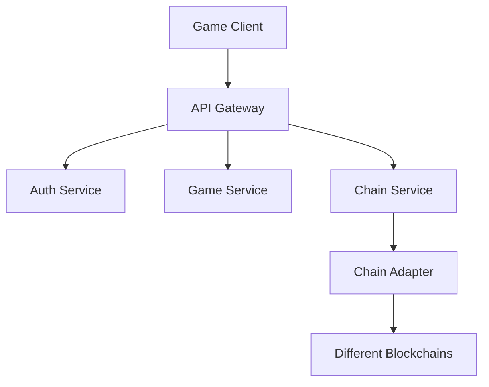

# Arcadia Game Server

## 架构设计

### 1. 系统架构


### 2. 核心服务

#### 2.1 认证服务 (Auth Service)
- JWT Token管理
- 节点认证
- 用户认证
- 签名验证

#### 2.2 游戏服务 (Game Service)
- 英雄数据管理
- 游戏逻辑处理
- 数据持久化
- 事件处理

#### 2.3 链服务 (Chain Service)
- 多链适配
- 合约交互
- 交易处理
- 数据同步

### 3. 数据流

#### 3.1 用户操作流程
1. 客户端发起请求
2. 网关验证基础参数
3. Auth Service验证身份
4. Game Service处理游戏逻辑
5. Chain Service处理链上交互
6. 返回结果给客户端

#### 3.2 节点注册流程
1. 节点生成密钥对
2. 向合约注册节点
3. 获取节点地址
4. 定期更新JWT Token

### 4. 安全设计

#### 4.1 通信安全
- 所有API使用HTTPS
- 请求签名验证
- JWT Token认证
- 节点间通信加密

#### 4.2 数据安全
- 敏感数据加密存储
- 私钥离线存储
- 定期数据备份
- 访问权限控制

### 5. 多链适配设计

#### 5.1 链适配器接口
```typescript
interface IChainAdapter {
    // 基础方法
    connect(): Promise<boolean>;
    disconnect(): Promise<void>;
    getBalance(address: string): Promise<string>;
    
    // 合约交互
    callContract(address: string, method: string, params: any[]): Promise<any>;
    sendTransaction(tx: Transaction): Promise<string>;
    
    // 数据查询
    queryHeroData(address: string): Promise<HeroData>;
    queryNFTData(tokenId: string): Promise<NFTData>;
}
```

#### 5.2 支持的链
- Aptos
- (预留其他链的扩展)

## API设计

### 1. 节点API

#### 1.1 节点注册
```
POST /api/v1/node/register
Headers:
  - x-node-address
  - x-node-sign
Body:
  - publicKey: string
  - ip: string
  - port: number
```

#### 1.2 节点认证
```
POST /api/v1/node/auth
Headers:
  - x-node-address
  - x-node-sign
Body:
  - timestamp: number
```

### 2. 用户API

#### 2.1 用户认证
```
POST /api/v1/user/auth
Headers:
  - x-chain-id
  - x-wallet-address
  - x-user-sign
Body:
  - challenge: string
```

#### 2.2 创建英雄
```
POST /api/v1/hero/create
Headers:
  - x-chain-id
  - x-wallet-address
  - x-user-sign
  - Authorization: Bearer <token>
Body:
  - nftId: string
  - name: string
  - class: string
  - race: string
```

#### 2.3 加载英雄数据
```
GET /api/v1/hero/load
Headers:
  - x-chain-id
  - x-wallet-address
  - Authorization: Bearer <token>
```

#### 2.4 保存英雄数据
```
POST /api/v1/hero/save
Headers:

  - x-chain-id
  - x-wallet-address
  - x-user-sign
  - Authorization: Bearer <token>
Body:
  - heroData: HeroData
```

### 3. 错误处理

#### 3.1 错误码设计
- 1000-1999: 系统错误
- 2000-2999: 认证错误
- 3000-3999: 业务错误
- 4000-4999: 链交互错误

#### 3.2 错误响应格式
```typescript
interface ErrorResponse {
    code: number;
    message: string;
    details?: any;
}
```

## 开发规范

### 1. 代码规范
- 使用TypeScript
- 遵循ESLint规则
- 使用Prettier格式化
- 编写单元测试

### 2. 文档规范
- API文档使用OpenAPI 3.0
- 代码注释遵循JSDoc
- 更新CHANGELOG
- 维护README

### 3. 部署规范
- 使用Docker容器化
- CI/CD自动化部署
- 环境配置分离
- 日志规范化 