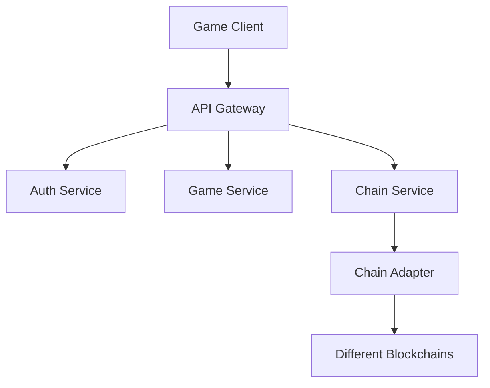

### 1. 系统架构


### 2. 核心服务

#### 2.1 认证服务 (Auth Service)
- JWT Token管理
- 节点认证
- 用户认证
- 签名验证

#### 2.2 游戏服务 (Game Service)
- 英雄数据管理
- 游戏逻辑处理
- 数据持久化
- 事件处理

#### 2.3 链服务 (Chain Service)
- 多链适配
- 合约交互
- 交易处理
- 数据同步

### 3. 数据流

#### 3.1 用户操作流程
1. 客户端发起请求
2. 网关验证基础参数
3. Auth Service验证身份
4. Game Service处理游戏逻辑
5. Chain Service处理链上交互
6. 返回结果给客户端

#### 3.2 节点注册流程
1. 节点生成密钥对
2. 向合约注册节点
3. 获取节点地址
4. 定期更新JWT Token

### 4. 安全设计

#### 4.1 通信安全
- 所有API使用HTTPS
- 请求签名验证
- JWT Token认证
- 节点间通信加密

#### 4.2 数据安全
- 敏感数据加密存储
- 私钥离线存储
- 定期数据备份
- 访问权限控制

### 5. 多链适配设计

#### 5.1 链适配器接口
```typescript
interface IChainAdapter {
    // 基础方法
    connect(): Promise<boolean>;
    disconnect(): Promise<void>;
    getBalance(address: string): Promise<string>;
    
    // 合约交互
    callContract(address: string, method: string, params: any[]): Promise<any>;
    sendTransaction(tx: Transaction): Promise<string>;
    
    // 数据查询
    queryHeroData(address: string): Promise<HeroData>;
    queryNFTData(tokenId: string): Promise<NFTData>;
}
```

#### 5.2 支持的链
- Aptos
- (预留其他链的扩展)


======
这样，我们已经完成了基础的服务发现和故障转移机制的实现。主要特点包括：
服务注册和发现
服务节点自动注册
健康检查机制
角色领导选举
节点状态管理
故障转移机制
自动检测节点故障
备份节点选举
基于性能指标的节点选择
平滑的状态转换
3. 可扩展性
支持动态添加新节点
支持不同类型的服务角色
可自定义节点能力声明
灵活的指标计算
监控和管理
实时状态监控
性能指标收集
日志记录
事件通知
接下来，我们可以：
实现具体的服务类（Auth、Game、City等）
添加服务间通信机制
3. 实现状态同步机制
添加安全机制
您想要我先实现哪个部分？

=======
